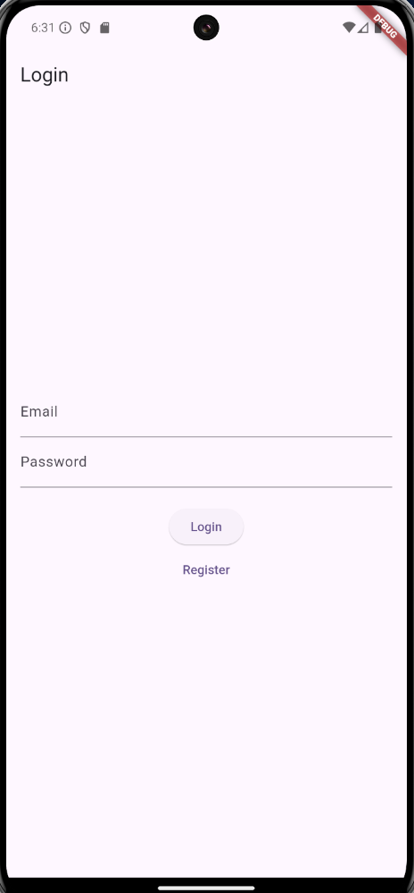
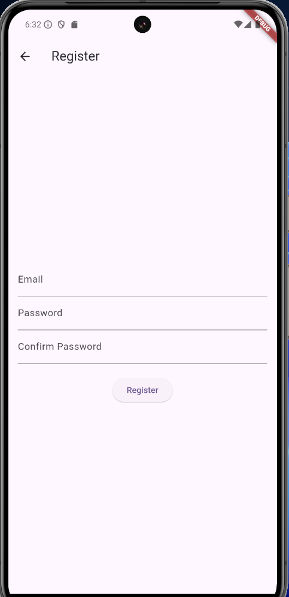
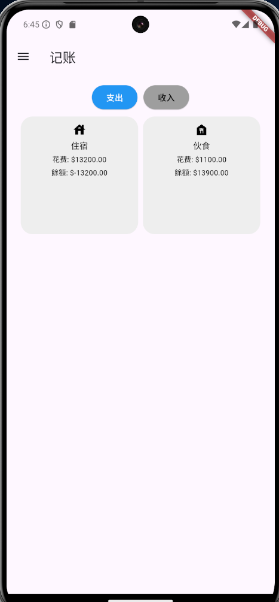
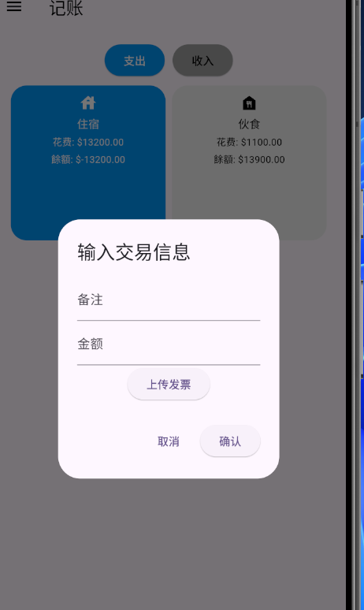
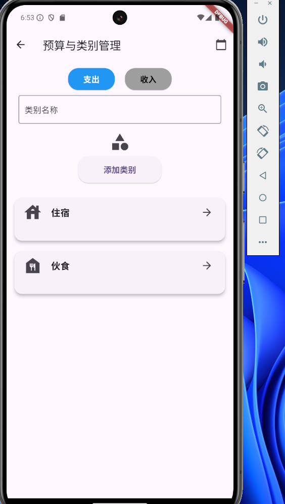

# My Accounting App

My Accounting App is a mobile application designed to help users manage their personal finances effectively. It provides features for budgeting, expense tracking, and generating financial reports. This app is built using Flutter and Firebase, ensuring a smooth and responsive experience on both iOS and Android platforms.

## Features

- **User Authentication:**
  - Register and log in using email and password.
  - Password reset via email.

- **Budget Management:**
  - Create, modify, and delete budget categories.
  - Set monthly budget amounts for each category.

- **Expense Tracking:**
  - Record expenses by selecting a budget category and entering the amount.
  - Option to upload receipts as photos.
  - View a list of all expenses for the current month.

- **Report Generation:**
  - Query reports by month, year, or custom date range.
  - View total expenses and income for the selected period.
  - Breakdown of expenses by category.
  - Visual representation of expenses using charts.

- **Settings:**
  - Customize app settings such as notifications, language, and theme.
  - Backup and restore data to/from the cloud.

## Features (中文)

- **用戶驗證：**
  - 使用電子郵件和密碼註冊和登入。
  - 通過電子郵件重置密碼。

- **預算管理：**
  - 創建、修改和刪除預算類別。
  - 設置每個類別的每月預算金額。

- **記賬：**
  - 選擇預算類別並輸入金額記錄支出。
  - 選擇是否上傳發票照片。
  - 查看當月所有支出記錄列表。

- **報表生成：**
  - 按月、按年或自定義日期範圍查詢報表。
  - 查看選定期間的總支出和總收入。
  - 按類別顯示支出情況。
  - 使用圖表直觀展示支出比例。

- **設置：**
  - 自定義應用設置，如通知、語言和主題。
  - 將數據備份到雲端並從雲端恢復數據。

## Screenshots

### Login Screen


### Register Screen


### Home Page


### New Transaction Screen


### Budget Management Screen


## Demo Video

You can watch a demo of the app in action:

[](assets/record.mp4)

## Installation

To run this project locally, follow these steps:

1. **Clone the repository:**
   ```bash
   git clone https://github.com/lohchanhin/accounting.git
   cd my_accounting_app

2. **Install dependencies:**
    flutter pub get

3. **Set up Firebase:**
    Create a Firebase project at Firebase Console.
    Add iOS and Android apps to your Firebase project.
    Download the google-services.json (for Android) and GoogleService-Info.plist (for iOS) files and place them in the respective directories as per the Firebase documentation.

4. **Run the app**
    flutter run

## 中文安装说明

1. **克隆存儲庫：**
   ```bash
   git clone https://github.com/your-username/my_accounting_app.git
   cd my_accounting_app
